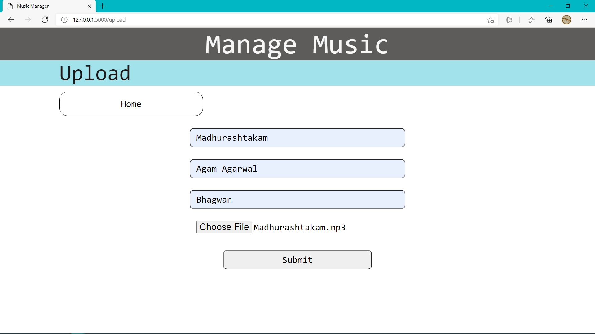
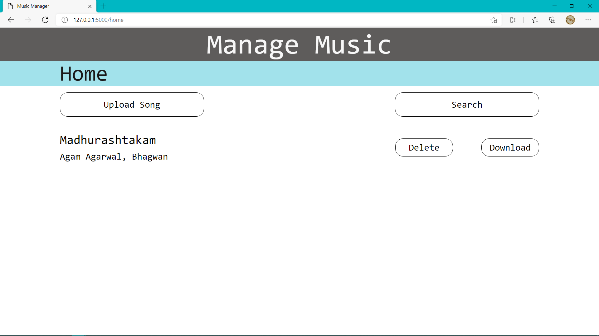
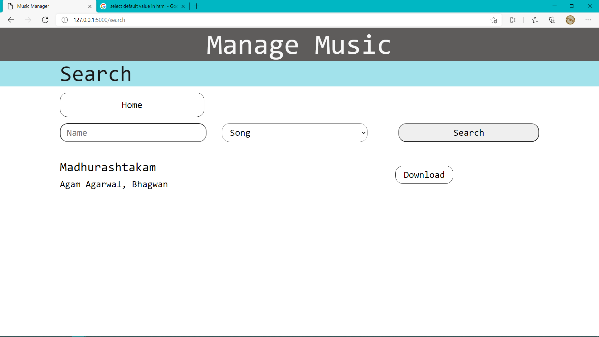
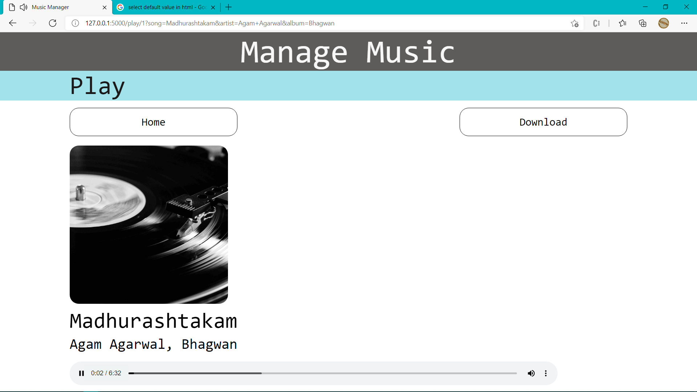
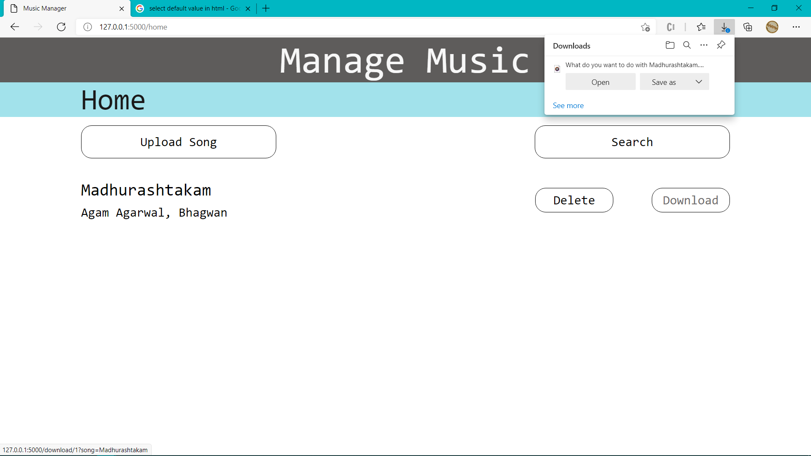

# Flask music app

This is a music management system built using Flask, which facilitates the tasks such as uploading songs, playing songs, and managing the playlist by taking the actions such as deleting songs.

## Dependencies

The required libraries for this project are mentioned in the [requirements.txt](requirements.txt) and can be installed by

> pip install -r requirements.txt

Or alternatively, installing each of the required library as follows

> pip install flask

> pip install mysql-connector-python

> pip install eyed3

> pip install python-magic-bin `#dependency for eyed3 on windows platform`

Make sure that mysql-server is set up. If not, read the [installation docs](https://dev.mysql.com/doc/mysql-getting-started/en/#mysql-getting-started-installing). One way to check if your server's up and running is by executing the command

> mysql -u root -p

If you are able to use the mysql shell, then that's all the installation you'd need to run the app.

## Start the app

Headover to the [musicApp](musicApp) folder

> cd musicApp

Run the app.py file

> python app.py

By now, Flask should serve the app at port 5000. Headover to [/home](http://localhost:5000/home). Begin with uploading your music files and creating your library. And then start listening to them on your browser.

## Screenshots

## Further Improvements

This is a minimal app for managing your music and there are a lot of improvements possible.

- Add authorization so that only authorized user can manage the playlists
